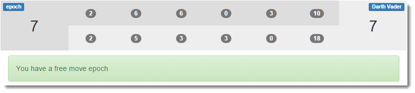
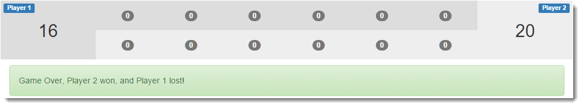

# kalah-game

A Java implementation of the Kalah board game

This game was built with strong OO concepts in mind, and it should be able to support 
multiple types of `Player` objects.

A few that I have in mind are `WebSocketPlayer`, `AjaxPlayer`, `RandomPlayer`, `AIPlayer`.

The game currently has a very basic front-end, it replicates state from the server via JSON

--- 

#### Obligatory Screenshot

#### Frameworks
* None

#### Backend Stack
* Java 7
* Maven
* Guava
* Gson
* slf4j
* jUnit

#### Frontend Stack
* Bootstrap
* PrototypeJS
* Initializer

#### IDE

Developed in Netbeans IDE, tested with Google Chrome, Apache Tomcat 7 & 8
